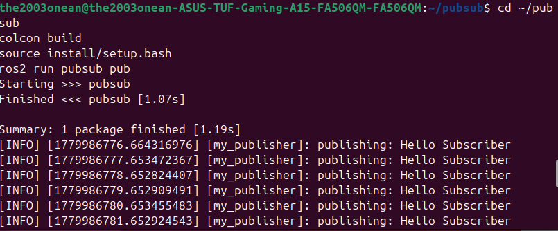
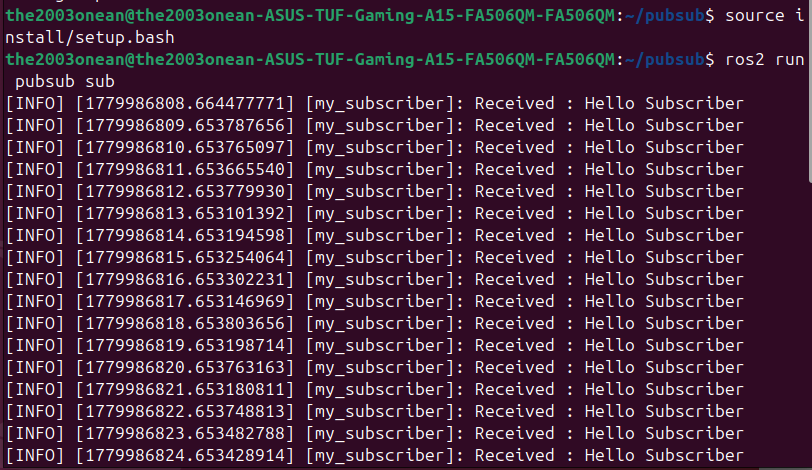

ROS 2 Publisher & Subscriber — Python
A simple ROS 2 pub/sub demo using rclpy. One node publishes a message every second, another receives it. This is the core communication pattern used in every ROS 2 robotics system.

How It Works
MyPublisher  →  /chatter (std_msgs/String, 1 Hz)  →  MySubscriber

Setup From Scratch
1. Create workspace and package
bashmkdir -p ~/ros2_ws/src
cd ~/ros2_ws/src
ros2 pkg create --build-type ament_python pubsub
2. Add the nodes
Copy publisher.py and subscriber.py into src/pubsub/pubsub/.
3. Register entry points in setup.py
pythonentry_points={
    'console_scripts': [
        'pub = pubsub.publisher:main',
        'sub = pubsub.subscriber:main',
    ],
},
4. Build and source
bashcd ~/ros2_ws
colcon build
source install/setup.bash
5. Run
Open two terminals, source the workspace in each.
bash# Terminal 1
ros2 run pubsub pub

# Terminal 2
ros2 run pubsub sub

Output
Publisher

Subscriber

Handy Commands
bashros2 topic list            # see all active topics
ros2 topic echo /chatter   # print messages live
ros2 topic hz /chatter     # check publish rate
rqt_graph                  # visualise node connections

Extending This
Replace std_msgs/String with any ROS 2 message type:
DataMessage TypeIMUsensor_msgs/ImuJoint anglessensor_msgs/JointStateCamerasensor_msgs/ImageVelocitygeometry_msgs/Twist

Requirements

Ubuntu 22.04 / 24.04
ROS 2 Jazzy or Humble
Python 3.10+

Author
Anup — MSc CS, Robotics & Automation, HAM Munich
GitHub · LinkedIn
